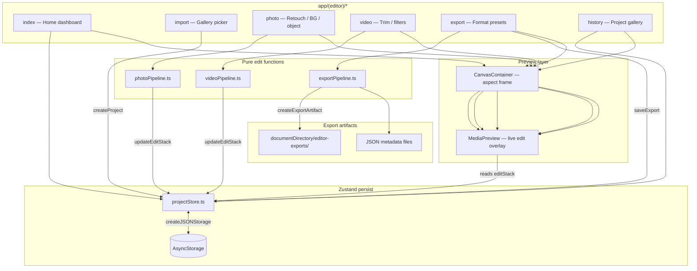

# Glam Studio AI — Editor Architecture

Mobile photo/video editor built with Expo Router, Zustand, and preview-layer pipelines. The **judging/demo build** is editor-only: `app/index.tsx` redirects to `/(editor)`; legacy Nebula template providers in `app/_layout.tsx` remain for compatibility but can be skipped via `EXPO_PUBLIC_EDITOR_ONLY=true`.

## Data flow

## Routes (`app/(editor)/`)

| Route | Role |
|-------|------|
| `index.tsx` | Home — active project preview, module shortcuts, import CTA |
| `import.tsx` | Hidden tab — `expo-image-picker` → `createProject()` |
| `photo.tsx` | Retouch presets, background templates, object-removal toggle |
| `video.tsx` | Trim window slider, filter chips, effect intensity |
| `export.tsx` | Story 9:16 / carousel formats → export artifacts |
| `history.tsx` | Past projects list, re-open, delete |
| `_layout.tsx` | Tab navigator (Home, Photo, Video, Past, Save); `import` has `href: null` |

Entry: `app/index.tsx` → `<Redirect href="/(editor)" />`.

Root stack (`app/_layout.tsx`): registers `(editor)` and `index` only. No legacy Nebula tab routes are mounted in the judging build.

## State — `lib/editor/projectStore.ts`

- **Zustand** store with **`persist`** middleware.
- Storage key: `editor-project-store` via **`AsyncStorage`** (`createJSONStorage`).
- Persisted slice: `activeProjectId`, `projects[]` (full project graph including `editStack` and `exports`).
- Actions: `createProject`, `updateEditStack`, `addFilter` / `removeFilter`, `saveExport`, `removeProject`, `selectProject`.
- Hook: `useActiveProject()` for the currently selected project.

Project shape (`lib/editor/types.ts`): URI-based media references only — no binary blobs in storage.

## Pipelines

Pure functions that return updated `editStack` slices or file artifacts. Screens call store actions after pipeline transforms.

| Module | Responsibility |
|--------|----------------|
| `photoPipeline.ts` | Retouch presets, background removal toggle, BG templates, object-removal mask id |
| `videoPipeline.ts` | Trim window (0–10s demo range), filter list, effect intensity |
| `exportPipeline.ts` | Writes JSON metadata artifacts to `FileSystem.documentDirectory/editor-exports/` |

**Export artifacts** are deterministic JSON handoff files (source URI, format, edit stack snapshot) — not re-encoded video files.

## UI components

### `CanvasContainer`

- Fixed aspect frames: `story` (9:16), `square` (1:1), `portrait` (4:5).
- Computes max width from window dimensions; exposes `onLayoutChange` for layout-sensitive tools.
- Provides bordered “stage” chrome; does **not** apply edits itself.

### `MediaPreview`

- Renders source media (`expo-image` / `expo-video`) inside the canvas.
- **Read-only visualization** of `editStack`: gradient BG swap, retouch tints, filter overlays, trim is reflected in badges/state (video plays full source; trim is metadata for export).
- All “AI” effects in MVP are **preview simulations** (overlays + layout), not on-device ML inference.

## Persistence

| Layer | Mechanism |
|-------|-----------|
| Project graph | Zustand persist → AsyncStorage |
| Export files | `expo-file-system` → app documents directory |
| Media sources | Device gallery URIs (not copied into store beyond URI string) |

## Startup modes

| Mode | Config | Behavior |
|------|--------|----------|
| Judging / demo (default) | `app/index.tsx` redirect | Lands in `/(editor)` immediately |
| Editor-only lean boot | `EXPO_PUBLIC_EDITOR_ONLY=true` | Skips Sentry, PostHog screen tracking, RevenueCat `SubscriptionProvider` init in `_layout.tsx` |

Set in `.env` (see `.env.example`). Analytics keys remain optional in all modes.

## Not in MVP (honest scope)

These are **intentionally absent** or simulated:

- **Native transcode** — no FFmpeg / AVFoundation re-encode; exports are JSON metadata artifacts
- **Real segmentation** — background removal and object cleanup are UI state + overlay previews, not ML masks
- **On-device inference** — no Core ML / TFLite / cloud inference pipeline wired to edits
- **Pixel-accurate export** — saved files describe edits; they do not bake filters into new media binaries
- **Server-side render queue** — no upload/processing backend for the editor flow

Demo reliability is prioritized: state is serializable, previews are deterministic, and export paths are filesystem-local.
